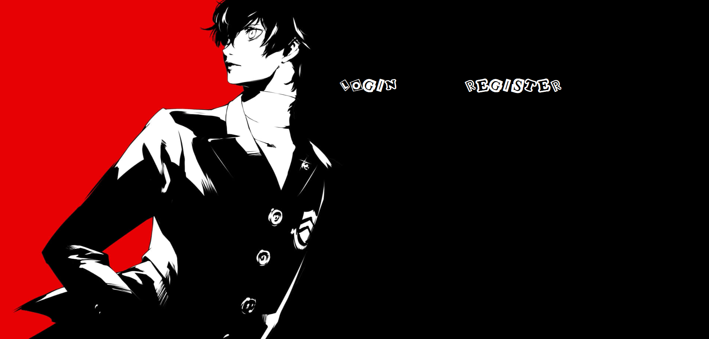
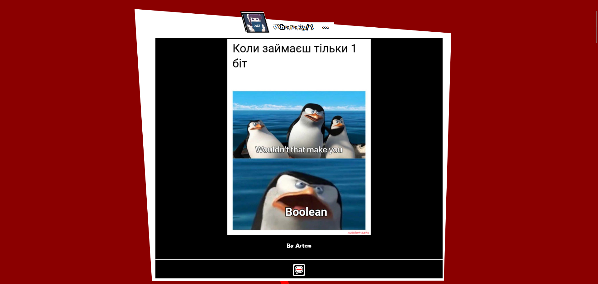
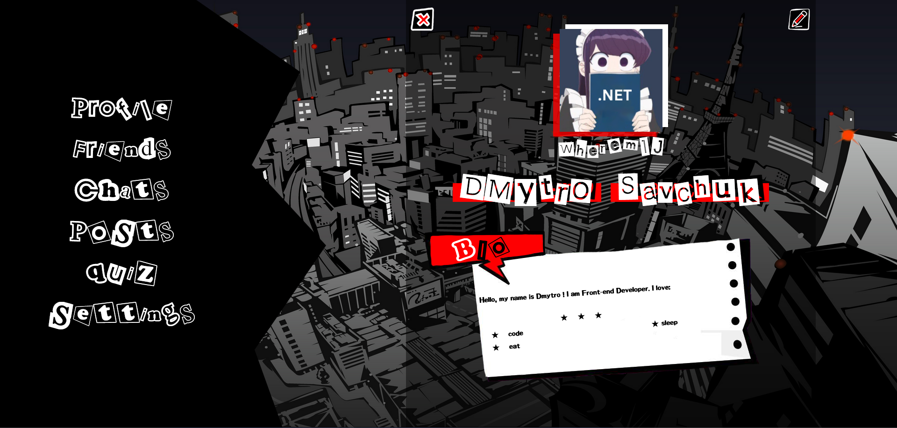
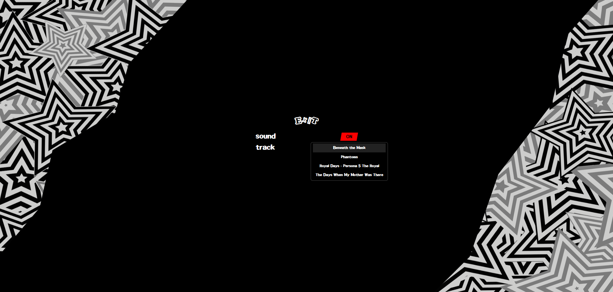

# Дмитро Савчук Володимирович (ІПЗк-24-1)
## курсова робота з дисципліни "back-end розробка"

-----

## Про проєкт:

### Back-end написано на PHP 8
### Front-end написано Angular 19

-----

#### Проєкт представляє собою соціальну мережу натхненну комп'ютерною грою "Persona 5"
#### Користувачі мають змогу спілкуватися між собою, ділитися новинами, постами, заводити друзів тощо

Прев'ю сторінок додатку

